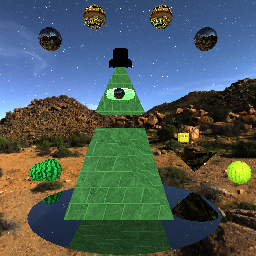

# raytracer

# Proyecto 2: Ray Tracer
- Imagen
    Presionar la tecla [s] para guardar el output

    

- Luces: 
    - Se uso una luz ambiental verde para que la figura se viera verde.
- Objetos: 
    - Piramide
    - Piramide truncada
    - Esferas
    - Planos
    - Discos 
    - Conos
    - Cubo
    - Cilindro
    - Environment Map
 
