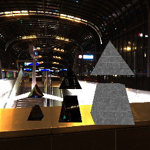

# raytracer

# RT2: Opaque, Reflective & Refractive Materials
- Figura
    Presionar la tecla [s] para guardar el output

    

    Siento que en la primera imagen no se aprecian tanto los reflectives, pero considero que en esta se pueden ver mejor: 
    

 
